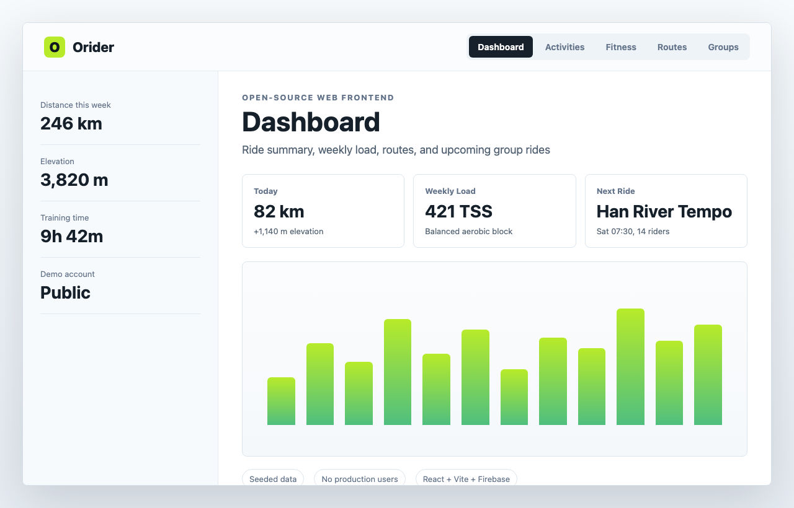
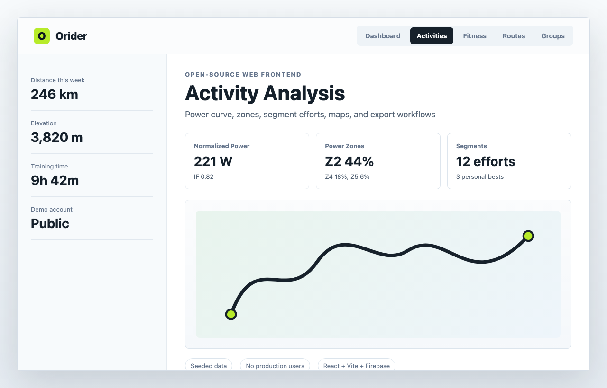
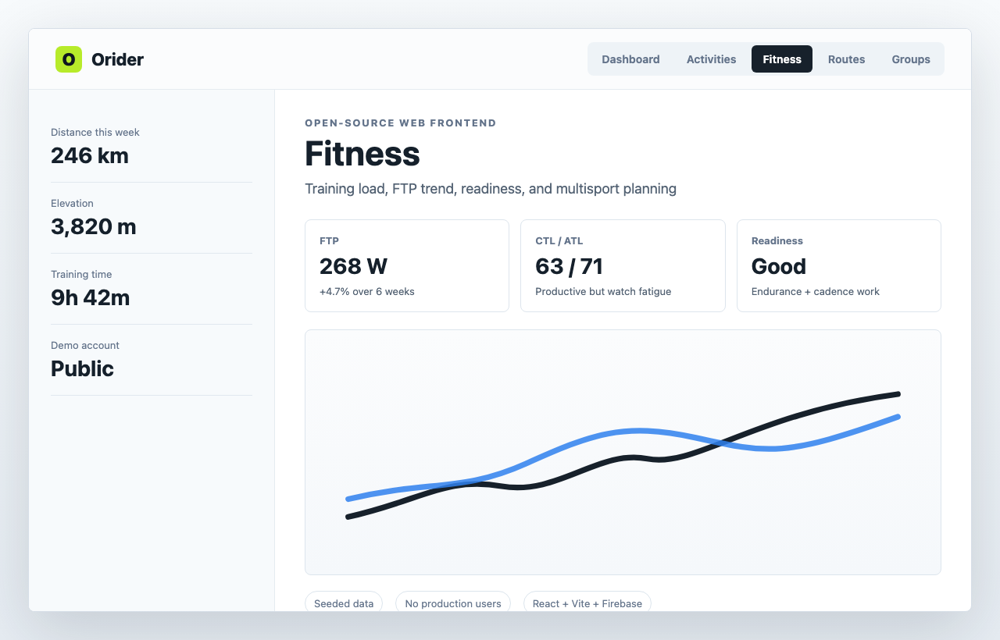
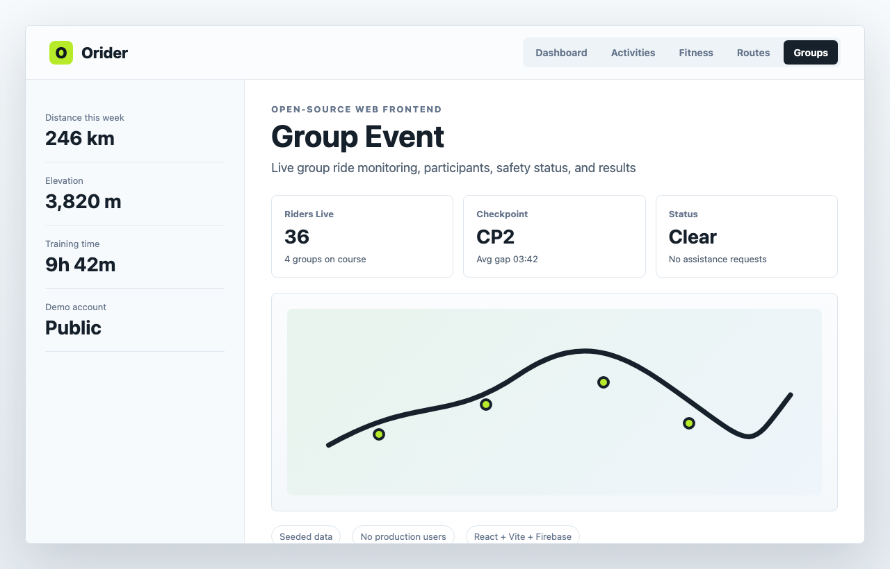

# Orider Web

[한국어](README-ko.md) | [English](README.md)

**Orider**는 자전거 컴퓨터 플랫폼을 위한 라이딩 분석, 그룹 이벤트, 코스 탐색, 훈련 대시보드 웹 프론트엔드입니다.

[서비스 바로가기](https://orider.co.kr) · [미션](MISSION.md) · [기여 안내](CONTRIBUTING.md) · [거버넌스](GOVERNANCE.md) · [개발 문서](docs/DEVELOPMENT.md) · [API와 연동](docs/API_AND_INTEGRATIONS.md) · [개인 데이터 API](docs/PERSONAL_DATA_API.md) · [Creator Showcase](docs/CREATOR_SHOWCASE.md) · [보안](SECURITY.md)

오라이더는 라이딩 기록, 코스와 구간 정보, 훈련 피드백, 그룹 라이딩 운영을 하나의 웹 경험으로 연결하려는 프로젝트입니다. 공개된 웹 프론트엔드는 스포츠 분석 UI에 관심 있는 사람들에게 실제 제품 수준의 차트, 지도, 모바일 흐름, 한국어/영어 문구, 접근성 패턴을 살펴보고 개선할 수 있는 기반을 제공합니다.



| 활동 분석 | 피트니스 대시보드 |
|---|---|
|  |  |

| 그룹 이벤트 운영 |
|---|
|  |

Orider Web은 샘플 앱이나 마케팅용 껍데기가 아닙니다. 라이더가 활동을 돌아보고, 파워와 피트니스 추이를 확인하고, 코스와 구간을 관리하고, 커뮤니티에 참여하고, 그룹 이벤트를 운영하는 실제 프로덕션 웹 클라이언트입니다.

오라이더는 자전거를 오래 좋아해 온 한 개발자가, 라이딩을 좋아하는 사람들에게 건네는 작은 선물 같은 마음에서 시작했습니다. 커뮤니티와 함께 만든 핵심을 닫힌 사유 제품으로 만들기보다, 누구나 들여다보고 개선하고 신뢰할 수 있는 **Our Rider**, **Open Rider**로 성장시키려 합니다.

> 이 저장소는 오라이더 웹 프론트엔드의 **프로덕션 기준 소스**입니다.
> 미러 저장소가 아닙니다. 개발은 이곳에서 진행되고, Pull Request는 이곳에서 리뷰되며, `main`은 보호된 워크플로를 통해 Firebase Hosting에 배포됩니다.
>
> 백엔드 서비스, 보안 규칙, 분석 파이프라인, 운영 도구는 별도로 관리됩니다.

## 누구에게 도움이 되나요?

| 대상 | 오라이더가 돕는 일 | 이 저장소에서 볼 수 있는 것 |
|---|---|---|
| 라이더 | 활동, 페이스, 파워, 존, 코스, 피트니스, 훈련 준비도를 확인합니다. | 제품 UI, 차트, 지도, 내보내기 흐름, 모바일 레이아웃, 문구 |
| 동호회와 팀 | 그룹 라이딩, 멤버, 리더보드, 이벤트, 현장 운영을 관리합니다. | 그룹/이벤트 화면, 내비게이션 패턴, 참가자 테이블, 지도 UX |
| 프론트엔드 기여자 | 비공개 백엔드 코드 없이 실제 제품 화면을 개선합니다. | React 컴포넌트, i18n 리소스, 테스트, 스크린샷, 문서, 순수 유틸리티 |
| 제품/UX 개발자 | 반복 사용이 많은 스포츠 분석 프론트엔드 구조를 살펴봅니다. | 대시보드, 활동 상세, 코스/구간, 훈련, 이벤트 UI 패턴 |
| 연동에 관심 있는 개발자 | Firebase, Mapbox, Strava를 사용하는 웹 클라이언트 경계를 이해합니다. | 공개 브라우저 설정, 연동 경계, 클라이언트 SDK 사용 방식 |
| 개인 데이터 활용자 | 자신의 오라이더 데이터로 차트, 알림, 리포트, 자동화를 만듭니다. | 최소한의 소유자 전용 Personal Data API, 레시피 템플릿, 훈련/내보내기 유틸리티 |

## 재사용할 수 있는 부분

- `shared/training/`의 **훈련 유틸리티**: 준비도, 피트니스, 주간 부하, 회복 시간, 라이더 유형, 워크아웃 가져오기, 구간 예측과 관련 테스트
- `src/utils/`의 **내보내기 유틸리티**: GPX, TCX, FIT, CSV, 캘린더 지향 출력
- `src/components/AnalysisTab.tsx`, 차트 컴포넌트, 지도 컴포넌트, 코스/구간 페이지의 **분석 UI 패턴**
- `src/i18n/resources/ko/`, `src/i18n/resources/en/`의 **다국어 구조**
- 프로덕션 비밀 값을 PR 빌드에 노출하지 않는 Vite/Firebase 프론트엔드 **테스트와 CI 패턴**

이 저장소의 범위 밖에 있는 백엔드 API, 프로덕션 규칙, 비공개 데이터 파이프라인, 서버 사이드 분석 작업은 재사용 대상이 아닙니다.

## 개인 데이터 방향

오라이더의 개발 방향 중 하나는 개인 데이터 접근입니다. 라이더가 자신의 오라이더 데이터를 개인 대시보드, 노트북, 알림, 리포트, 자동화에 사용할 수 있어야 한다고 봅니다.

첫 공개 API 범위는 로그인한 라이더 본인의 프로필, 활동, 스트림, 피트니스 요약을 읽을 수 있는 소유자 전용 읽기 API입니다. 더 넓은 앱 등록과 자동화 권한은 아직 초기 단계입니다. 현재 Firebase callable endpoint를 긁어 쓰는 방식은 대체 경로로 간주하지 않습니다.

시작점으로는 다음 문서가 유용합니다.

- [Personal Data API](docs/PERSONAL_DATA_API.md): 현재 제공되는 최소 엔드포인트, 권한 범위, 보안 요구사항
- [Personal Data Recipes](docs/recipes/personal-data.md): AI 라이딩 일지, 주간 부하 이메일, 고강도 날 알림, 장거리 라이딩 로그 패키지, 월간 라이딩 배지 예시
- [Creator Showcase](docs/CREATOR_SHOWCASE.md): 라이더가 레시피를 발견하고, 아이디어를 시험하고, 개인정보를 보호한 결과 카드를 공유하는 제품 표면
- `shared/training/`, `src/utils/export*.ts`: 프로덕션 API 없이도 테스트할 수 있는 로컬 계산과 내보내기 동작

## 왜 공개하나요?

대부분의 자전거 플랫폼은 디바이스 앱, 소셜 네트워크, 훈련 대시보드, 이벤트 도구가 서로 나뉘어 있습니다. 오라이더는 이 표면들을 가능하면 연결된 경험으로 다루려 합니다.

- 라이딩을 기록하고 가져옵니다.
- 파워, 페이스, 존, 코스, 구간을 분석합니다.
- 자전거, 러닝, 수영, 트라이애슬론 관점에서 피트니스를 살펴봅니다.
- 그룹과 라이브 이벤트를 운영합니다.
- 번역, 접근성, UI, 테스트 기여가 가능하도록 웹 프론트엔드를 열어 둡니다.

웹 프론트엔드를 오픈소스로 공개하는 이유는 제품 경험의 큰 부분이 UI의 명확성에 있기 때문입니다. 차트, 코스 지도, 모바일 흐름, 한국어/영어 문구, 빈 상태, 접근성, 문서는 라이더가 실제로 서비스를 이해하고 신뢰하는 데 직접 연결됩니다.

이 프로젝트는 AGPL-3.0, DCO 기반 기여, 공개 거버넌스, 별도 상표 정책을 사용합니다. 커뮤니티가 함께 만든 핵심을 사유화하기 어렵게 하면서도, 라이더와 공식 서비스 정체성을 보호하기 위한 선택입니다. 자세한 내용은 [MISSION.md](MISSION.md), [GOVERNANCE.md](GOVERNANCE.md), [DCO.md](DCO.md), [FUNDING.md](FUNDING.md), [TRADEMARK.md](TRADEMARK.md)를 참고하세요.

## 살펴볼 수 있는 영역

### 라이딩 분석

- 지도, 내보내기, 파워 지표, 랩 테이블, 구간 기록, 소셜 액션, 수정/업로드 흐름이 있는 활동 상세 페이지
- 파워 커브, 존 분포, 회복 추정, 라이더 유형, 코호트 랭킹, 대사량, 가상 파워 배지, AI 요약 카드용 분석 컴포넌트
- GPX, TCX, FIT, CSV, 캘린더 지향 출력 유틸리티

관련 코드:

- `src/pages/ActivityPage.tsx`
- `src/components/AnalysisTab.tsx`
- `src/components/PowerCurveChart.tsx`
- `src/components/ZoneDistributionChart.tsx`
- `src/utils/exportGpx.ts`, `src/utils/exportFit.ts`, `src/utils/exportTcx.ts`

### 피트니스와 훈련

- 자전거, 러닝, 수영, 트라이애슬론 피트니스 뷰
- 훈련 로그, 목표 설정, 플랜 페이지, 워크아웃 편집, 오늘의 워크아웃 카드, 부하/적응 배너, 피트니스 예측
- FTP 테스트, 회복 시간, 준비도, 예상 파워, 주간 부하, VO2max, 워크아웃 가져오기, 구간 예측을 위한 순수 훈련 모듈

관련 코드:

- `src/pages/FitnessPage.tsx`
- `src/pages/fitness/BikeFitnessView.tsx`
- `src/pages/fitness/RunFitnessView.tsx`
- `src/pages/fitness/SwimFitnessView.tsx`
- `src/pages/fitness/TriFitnessView.tsx`
- `src/pages/PlanPage.tsx`
- `shared/training/`

### 코스, 구간, 탐색

- 코스 생성/수정 흐름, 코스 지도, 고도 차트, 코스 가져오기/내보내기, 구간 페이지, 리더보드, 챌린지 피드, 히트맵/타일 연동 훅
- Mapbox 기반 화면과, 지도 지원이 없는 환경을 위한 fallback placeholder

관련 코드:

- `src/pages/CoursesPage.tsx`
- `src/pages/CoursePage.tsx`
- `src/pages/CreateCoursePage.tsx`
- `src/pages/SegmentPage.tsx`
- `src/pages/ExplorePage.tsx`
- `src/components/RouteMap.tsx`
- `src/components/explore/HeatmapLayer.tsx`

### 그룹, 커뮤니티, 소셜

- 게시판 글, 댓글, 친구 흐름, 선수 프로필, 그룹 대시보드, 멤버 관리, 그룹 라이딩, 그룹 리더보드
- 반복적으로 쓰이는 라이더 워크플로를 위한 모바일 중심 피드/로그/플랜/설정 컴포넌트

관련 코드:

- `src/pages/BoardPage.tsx`
- `src/pages/PostDetailPage.tsx`
- `src/pages/FriendsPage.tsx`
- `src/pages/AthletePage.tsx`
- `src/pages/group/`
- `src/components/mobile/`

### 이벤트

- 이벤트 생성/수정, 참가 등록, 참가자 테이블, 라이브 이벤트 화면, 운영자 대시보드, 이벤트 지도, 결과
- 그란폰도 스타일 라이딩, 그룹 모니터링, 공개 이벤트 페이지에 활용할 수 있는 구조

관련 코드:

- `src/pages/event/EventDetailPage.tsx`
- `src/pages/event/EventLivePage.tsx`
- `src/pages/event/EventDashboardPage.tsx`
- `src/pages/event/EventParticipantsPage.tsx`
- `src/components/event/EventMap.tsx`

### 다국어와 제품 문구

- 한국어와 영어 리소스는 프로젝트의 주요 파일입니다.
- 문구, 빈 상태, 설정 라벨, 온보딩 표현, 이벤트/소셜 용어는 좋은 기여 영역입니다.

관련 코드:

- `src/i18n/resources/ko/`
- `src/i18n/resources/en/`
- `src/components/i18n/`

## 스크린샷

`docs/screenshots/`의 스크린샷은 시드 또는 데모 데이터만 사용합니다. 공개 저장소의 제품 설명을 위한 이미지이며, 실제 사용자, 비공개 라이딩, 정밀 위치, 이메일, 토큰, 권한 있는 데이터는 포함하지 않습니다.

## 아키텍처 경계

이 저장소에 포함되는 것:

- React/Vite 프론트엔드 코드
- 프론트엔드에서 사용하는 공유 TypeScript 타입과 순수 훈련 유틸리티
- 생성된 매뉴얼과 공개 정적 자산
- CI, 배포, 이슈, PR 템플릿

이 저장소에 포함되지 않는 것:

- Cloud Functions 구현
- Firestore 또는 Storage 프로덕션 규칙
- 비공개 분석 파이프라인
- 서버 사이드 AI/훈련 로직
- 서비스 계정, 프로덕션 export, 운영 비밀 값

프론트엔드 코드는 보안 경계가 아닙니다. 접근 제어는 백엔드 서비스와 Firebase 보안 규칙에서 강제되어야 합니다.

Firebase 프로젝트 ID, App Check site key, Mapbox public token, Strava client ID 같은 브라우저 설정 값은 설계상 공개 값입니다. 프로덕션 접근 모델과 로컬 개발 제한은 [API and integrations](docs/API_AND_INTEGRATIONS.md)를 참고하세요.

오라이더는 현재 자신의 데이터를 활용하려는 로그인 라이더를 위해 작은 소유자 전용 Personal Data API를 제공합니다. 아직 넓은 범위의 제3자 앱 플랫폼, OAuth 앱 등록, 이 저장소에서 재사용 가능한 백엔드를 제공하지는 않습니다. 외부 자동화는 Firebase callable endpoint를 긁는 대신 범위가 지정된 Personal Data API key를 사용해야 합니다.

## 기술 스택

- React 19, Vite, TypeScript
- Firebase client SDK: Auth, Firestore, Functions, Hosting
- TanStack Query, i18next, Chart.js, Mapbox GL
- Vitest, Playwright
- 보호된 production deploy를 사용하는 GitHub Actions

## 로컬 개발

요구사항: Node.js 20 이상

```bash
cp .env.example .env
npm ci
npm run dev
```

터미널에 표시되는 로컬 Vite URL을 엽니다. 보통 `http://localhost:5173`입니다.

자주 쓰는 확인 명령:

```bash
npm run lint
npm test
npm run build
npm run e2e
```

개발 모드:

| 모드 | 적합한 작업 | 참고 |
|---|---|---|
| Placeholder config | 문서, 문구, 레이아웃, 순수 컴포넌트, 단위 테스트 | 일부 경로는 로딩/빈 상태/권한 상태로 보일 수 있습니다. |
| Firebase emulators | Auth와 Firestore 중심 테스트 | `npm run e2e`가 auth/firestore emulator를 시작합니다. |
| Maintainer Firebase project | 전체 연동 작업 | 메인테이너가 제공한 설정과 권한이 필요합니다. |

프론트엔드만 검토할 때 유용한 경로:

| 경로 | 확인하기 좋은 것 | 프로덕션 데이터가 없을 때 예상 |
|---|---|---|
| `/` | 앱 셸, 대시보드 레이아웃, 내비게이션, 로딩 상태 | 빈 상태 또는 로그인 의존 상태가 보일 수 있습니다. |
| `/fitness` | 피트니스 탭, 차트 컨테이너, 훈련 문구 | 전체 차트는 mock/seed 데이터가 필요합니다. |
| `/courses` | 코스 목록 UI, 코스 카드, 빈 상태 | 빈 상태가 보일 수 있습니다. |
| `/explore` | 지도 fallback, 구간 탐색 레이아웃 | 유효한 token이 없으면 Mapbox가 fallback될 수 있습니다. |
| `/events` | 이벤트 목록과 운영 진입점 | 빈 상태가 보일 수 있습니다. |
| `/settings` | 계정, 연동, 훈련, 장치 설정 UI | 로그인 흐름은 Firebase/Auth context가 필요합니다. |

### 기여자는 무엇을 할 수 있나요?

가장 빠른 시작점은 바꾸고 싶은 내용에 따라 다릅니다.

| 목표 | 시작 위치 | PR 전 확인 |
|---|---|---|
| 문구나 번역 수정 | `src/i18n/resources/ko/`, `src/i18n/resources/en/` | `npm test` |
| 레이아웃이나 UI 상태 개선 | `src/pages/`, `src/components/`, `src/components/mobile/` | `npm run lint`, `npm run build` |
| 차트나 라이딩 분석 개선 | `src/components/AnalysisTab.tsx`, `src/utils/`, `shared/training/` | `npm test`, `npm run build` |
| 문서나 설정 안내 개선 | `README.md`, `CONTRIBUTING.md`, `docs/` | 코드 변경이 없으면 전체 build는 필수 아님 |
| E2E 커버리지 추가 | `tests/`, Playwright config | `npm run e2e` |

메인테이너 Firebase 접근 권한이 없다면 UI, 문구, 테스트, 순수 유틸리티, 문서, placeholder config 또는 mock 데이터로 실행 가능한 컴포넌트에 집중하는 것이 좋습니다. Cloud Functions, Firestore rules, Strava token exchange, 프로덕션 분석 파이프라인 같은 백엔드 동작은 이 저장소에서 변경할 수 없습니다.

자세한 내용은 [Development and Deployment](docs/DEVELOPMENT.md)를 참고하세요.

## 기여하기

좋은 첫 기여 영역:

- 한국어/영어 번역과 제품 문구
- 접근성 라벨, 키보드 흐름, focus order, semantic markup
- 모바일 웹 레이아웃 문제
- 차트 가독성, 빈 상태, 로딩 상태, 오류 상태
- 반복 사용자 흐름에 대한 Playwright 커버리지
- 문서, 스크린샷, 설정 안내

브랜치 이름과 PR 흐름은 [Branching Model](docs/BRANCHING.md)에 정리되어 있습니다. 보안에 민감한 문제는 공개 이슈로 올리지 말고 [SECURITY.md](SECURITY.md)를 사용하세요.

기여에는 [Developer Certificate of Origin](DCO.md)을 사용합니다. `git commit -s`로 커밋에 서명하면, 광범위한 저작권 양도 없이도 프로젝트 라이선스 아래에서 기여가 유지됩니다.

### Pull Request를 열기 전에

1. `main`에서 브랜치를 만듭니다.
2. 하나의 사용자 관점 수정, 하나의 컴포넌트 영역, 하나의 문서 개선처럼 PR 범위를 작게 유지합니다.
3. 위 표에서 변경에 맞는 최소 확인 명령을 실행합니다.
4. UI 변경이라면 가능하면 스크린샷이나 화면 녹화를 포함합니다.
5. 리뷰에 필요한 경로, 브라우저 크기, 언어, 데이터 상태를 설명합니다.

저장소가 공개되면 외부 기여자도 PR을 열 수 있습니다. 메인테이너는 보호된 `main`을 통해 리뷰하고 머지합니다. `main` 직접 push는 비활성화되어 있습니다.

## 저장소 운영 모델

- `main`은 보호됩니다.
- 모든 변경은 Pull Request를 거칩니다.
- CI는 PR에서 실행됩니다.
- `main`은 보호된 GitHub Environment를 통해 Hosting에 배포됩니다.
- 백엔드 저장소는 functions, database rules, storage rules, private jobs를 별도로 배포합니다.

## 공개 준비 상태

이 저장소는 공개 릴리스 게이트가 닫혀 있는 동안 아직 private 상태입니다.

추적 중인 차단 조건:

- H-5: GitHub hidden `refs/pull/*`에 과거 webhook token snapshot이 남아 있어 GitHub Support purge 또는 저장소 재생성이 필요합니다.
- visibility 변경 전 보안 리뷰를 다시 실행해야 합니다.

자세한 내용은 [Public Release Checklist](docs/PUBLIC_RELEASE_CHECKLIST.md)를 참고하세요.

최종 공개 전환은 private history를 mirror push하는 방식이 아니라, 검토가 끝난 working tree에서 깨끗한 저장소를 재생성하는 방식입니다. [Public Repository Cutover](docs/PUBLIC_REPOSITORY_CUTOVER.md)를 참고하세요.

## 라이선스와 상표

- 코드: [GNU AGPL-3.0](LICENSE)
- 기여: [DCO 1.1](DCO.md)
- 거버넌스와 미션: [MISSION.md](MISSION.md), [GOVERNANCE.md](GOVERNANCE.md), [FUNDING.md](FUNDING.md)
- 브랜드: "Orider", "ORIDER", Orider 로고는 상표이며 코드 라이선스로 허가되지 않습니다. Fork는 자체 브랜드를 사용해야 합니다. [TRADEMARK.md](TRADEMARK.md)를 참고하세요.

## 링크

- [Contributing](CONTRIBUTING.md)
- [Security Policy](SECURITY.md)
- [Development and Deployment](docs/DEVELOPMENT.md)
- [Branching Model](docs/BRANCHING.md)
- [Public Release Checklist](docs/PUBLIC_RELEASE_CHECKLIST.md)
