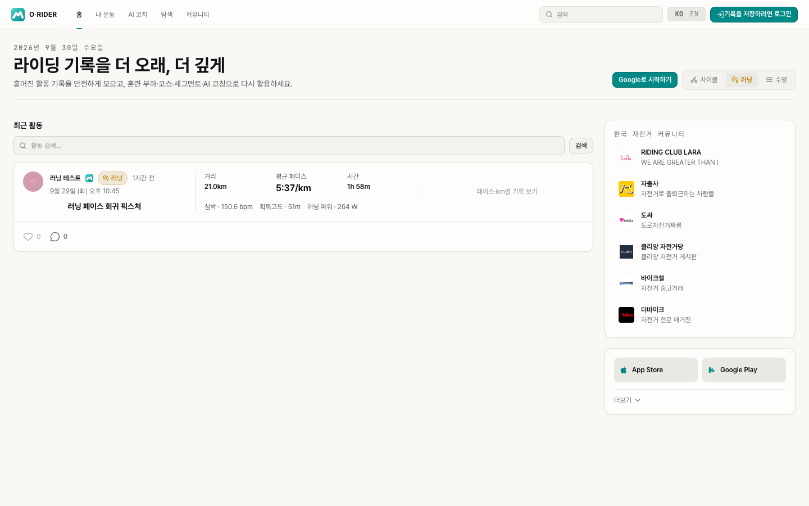
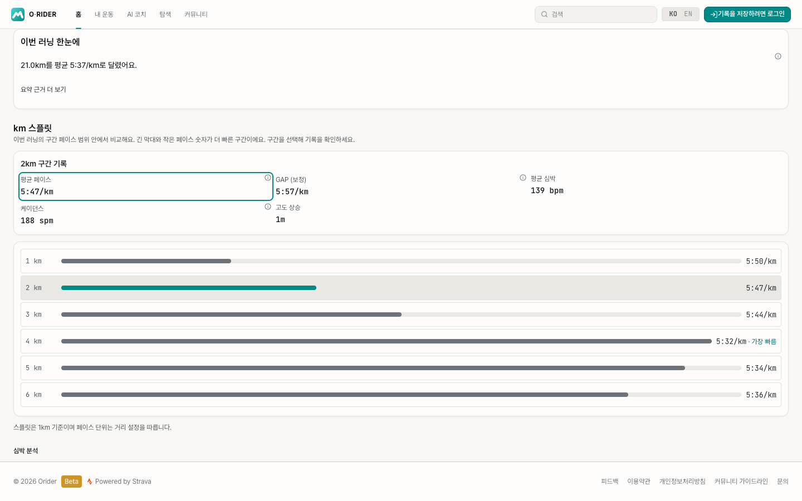
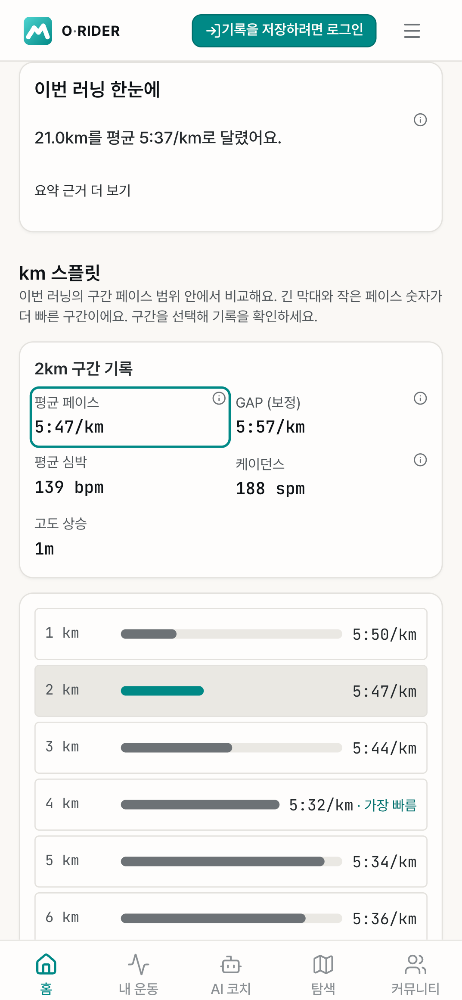
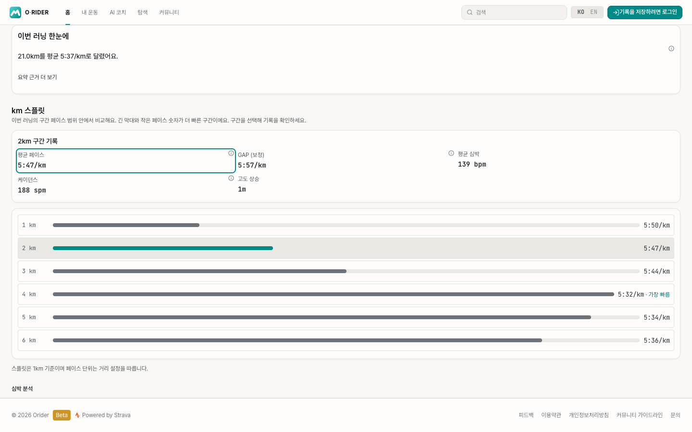
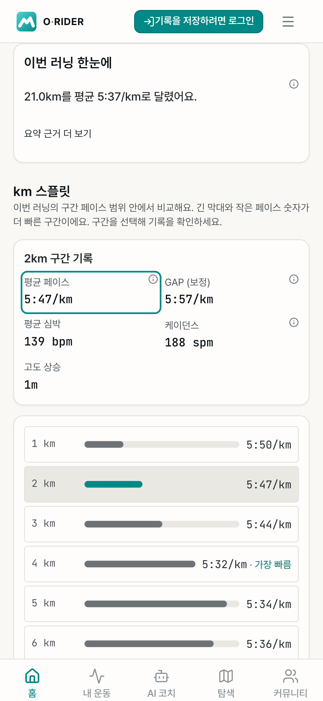
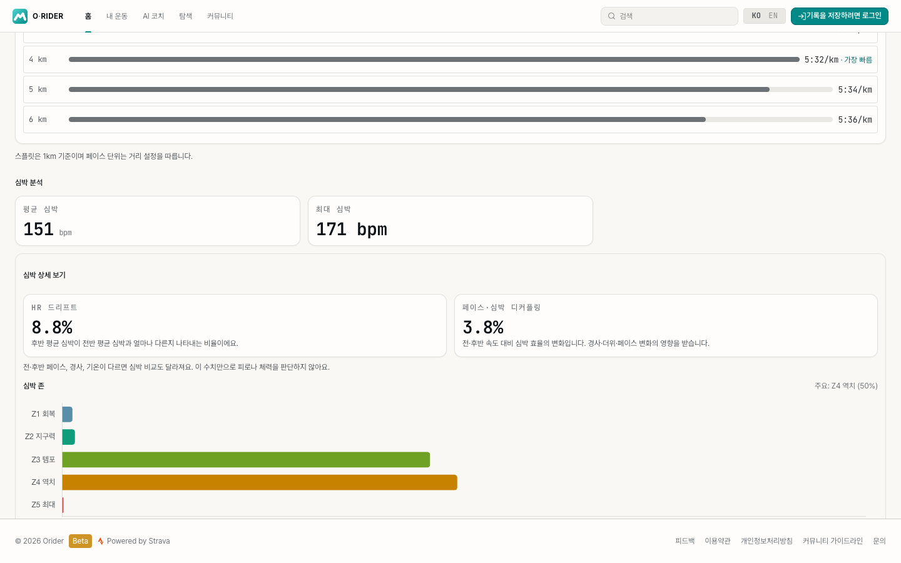
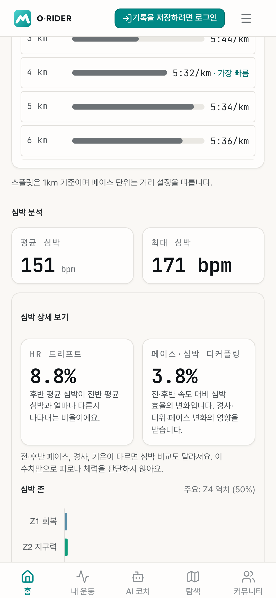

# 러닝 홈·분석 화면 검증 / Running web parity

합성 공개 러닝 활동으로 실제 홈과 활동 상세 경로를 확인했다. 운영 계정·경로·좌표를 사용하지 않으며 Firebase Auth/Firestore 에뮬레이터만 사용한다. 공개 분석 문서만 있고 원시 스트림이 없는 상태에서도 페이스, GAP, 심박 존, 케이던스, 실측 러닝 파워와 스플릿이 표시된다.

These screenshots use a synthetic public run with no production accounts, coordinates, or raw streams. The home and activity detail routes render server-authoritative running metrics through Firebase emulators. Native cadence is already steps/minute and is not doubled; only explicitly identified Strava strides/minute is converted.

- 경로 / Routes: `/ko/`, `/ko/activity/running-parity-public`
- 데스크톱 / Desktop: 1440 × 900, Chrome
- 모바일 / Mobile: 390 × 844, Chrome
- 검증 / Checks: four Playwright flows passed (home and public detail on both viewports). The 21-split fixture checks keyboard selection, immediately available pace/GAP/HR/cadence detail, the metric explanation dialog, and folded technical metrics/raw data.
- 홈은 거리·페이스·시간을 우선 표시한다. 분석은 쉬운 요약 → 선택형 스플릿 → 펼치는 상세 순서다 / Feed primary stats are distance, pace and time; analysis follows recap, interactive splits, then disclosures.
- 모바일은 주 요약을 먼저 보여주고 보조 요약·심박 존과 전문 비교 지표는 접는다. 펼친 심박 상세에는 정의와 해석 한계를 함께 표시한다 / Auxiliary recap and advanced HR details are collapsed; expanded HR comparisons include definitions and limitations.
- 개인 여정과 지난 이력 비교는 별도 owner/component 회귀로 검증했다 / Owner-only journey and historical comparison are covered by component regressions, not real-account browser evidence.
- 과거 비교는 같은 Run/TrailRun/VirtualRun 유형의 활동 전 4주만 사용하며 확인한 유효 기록 수를 표시한다. 조회 실패·불완전 기간·부족한 표본은 비교를 생략한다 / Prior-window comparisons match subtype and expose observed sample count; failed, incomplete and sparse windows do not produce a comparison.
- 지도·고도 연결은 합성 스트림을 사용하는 ActivityPage 통합 테스트로 확인했다. 선택한 2km의 원시 경로 인덱스와 차트의 실제 1000–2000m 범위, 개요 전환 후 유지, 차트 탐색, 다른 활동으로 이동 시 초기화를 확인한다. 지도와 차트는 테스트 대역이므로 실제 Mapbox 렌더링 증거는 아니다 / A synthetic-stream component integration checks raw route indices, sampled elevation distance boundaries, tab transitions, hover and activity changes. Map and chart are mocked; this is not live Mapbox rendering evidence.
- 위 브라우저 픽스처에는 스트림이 없으므로 지도·고도 보기 버튼이 나타나지 않는 것도 확인한다 / The no-stream browser fixture checks that the location action is absent.
- 운영 반영 / Delivery: screenshots show local implementation; production deployment and existing-activity recomputation are separate steps.

```sh
JAVA_HOME=/opt/homebrew/opt/openjdk/libexec/openjdk.jdk/Contents/Home firebase emulators:exec --project demo-orider-running-parity --only auth,firestore 'npx playwright test --config e2e/running-parity.config.ts'
```

## 홈 / Home




## 서버 지표만 있는 공개 분석 / Public analysis without raw streams









## 펼친 심박 상세 / Expanded HR evidence




